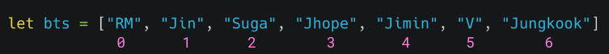

<h1 align="center">
  
</h1>

# Tema da Aula

Turma Online 20 - Todas em Tech  | Front-end | Semana 5 | 2022 | Professora Ana Beatriz Morita

### Instruções
Antes de começar, vamos organizar nosso setup.
* Fork esse repositório 
* Clone o fork na sua máquina (Para isso basta abrir o seu terminal e digitar `git clone url-do-seu-repositorio-forkado`)
* Entre na pasta do seu repositório (Para isso basta abrir o seu terminal e digitar `cd nome-do-seu-repositorio-forkado`)

### Resumo
O que veremos na aula de hoje?
* [Estrutura de dados](#Estrutura-de-dados)
* [Arrays](#Arrays)
* [Objetos](#Objetos)
* [Escopo](#Escopo)
* [Funçoes](#Funcoes)
* [Métodos de Array](#Métodos-de-array)

## Conteúdo

### Estrutura de dados 
### Arrays 
1. [Acessando itens de um Array](#Acessando-itens-de-um-Array)
2. [Tamanho de uma lista](#Tamanho-de-uma-lista)
3. [push](#push)
4. [pop](#pop)
5. [shift](#shift)
6. [unshift](#Acessando-itens-de-um-Array)
   
### Objetos
1. [Acessando valores de um objeto](#acessando-valores-de-um-objeto)
2. [Adicionando propriedades a um objeto](#adicionando-propriedades-a-um-objeto)
2. [Deletando propriedades de um objeto](#deletando-propriedades-de-um-objeto)
### Escopo

### Funções
1. [Assinatura](#assinatura)
2. [Arrow Function](#arrow-function)
3. [Função anônima](#funcao-anonima)
4. [Callback](#callback)
### Métodos de Array
1. [For Each](#for-each)
2. [Map](#map)
3. [Slice](#slice)
4. [Splice](#splice)
4. [Filter](#filter)
4. [Find](#find)
4. [FindIndex](#findIndex)
4. [reduce](#reduce)

### Estrutura de dados 
Estrutura de dados é o ramo da computação que estuda os diversos mecanismos de organização de dados para atender aos diferentes requisitos de processamento. As estruturas de dados definem a organização, métodos de acesso e opções de processamento para a informação manipulada pelo programa.

A administração e manipulação dos dados passam pelo entendimento das estruturas de dados e dos métodos que podem ser utilizados para trabalhar com esses dados.

Logo, Estrutura de Dados - ou Data Structure - é um meio de coletar e organizar informações de uma certa forma em que seja possível realizar operações com essas informações de um jeito efetivo.


### Arrays
Arrays ou listas sõ estruturas de dados ordenadas que permitem que seja possível guardar um conjunto de informações numa única variável. Cada item que compõe essa lista normalmente é chamado de elemento. Os elementos de um array no javascript tem sua posição definida por um índice que se inicia em 0.

#### Acessando itens de um array
Para acessar um item de um array é muito simples, basta utilizarmos o índice da posição do item.

``` javascript
let personagens = ["Naruto", "Midoriya", "Tanjiro", "Maki"];
personagens[0] // Naruto
personagens[2] // Tanjiro
```

#### Tamanho de uma lista
É possível saber o tamanho de uma lista acessando a propriedade length

``` javascript
let personagens = ["Naruto", "Midoriya", "Tanjiro", "Maki"];
personagens.length // 4
```

#### Verificando que um array é um array
No JavaScript nós temos o comando Array.isArray(obj); que permite verificar se um objeto é um array.

```javascript
  let lista = [];
  Array.isArray(lista) // true
```

##### push
O comando "push" pode ser usado para adicionar valores a ele. Este comando adiciona o valor no final da lista.

```javascript
const numeros = [1, 2, 3];

numeros.push(4);

console.log(numeros); // [1, 2, 3, 4]

numeros.push(5, 6);

console.log(numeros); // [1, 2, 3, 4, 5, 6]
```
##### pop
O oposto do push, ele retira e retorna o último valor do vetor.
```javascript
const numeros = [1, 2, 3, 4];

numeros.pop(); // 4

console.log(numeros); // [1, 2, 3]

numeros.pop(); //3

console.log(numeros); // [1, 2]
```
##### shift
O método shift() remove o primeiro elemento de um array e retorna esse elemento. Este método também muda o tamanho do array.

```javascript
const numeros = [1, 2, 3, 4];

numeros.shift(); // 1

console.log(numeros); // [2, 3, 4]

numeros.shift(); // 2

console.log(numeros); // [3, 4]                                       
```

##### unshift
O método unshift() adiciona um ou mais elementos no início de um array e retorna o número de elementos (a propriedade length) atualizado.

```javascript
const numeros = [1, 2, 3, 4];

numeros.unshift(0); // 5

console.log(numeros); // [0, 1, 2, 3, 4]

numeros.unshift(-1); // 6

console.log(numeros); // [-1, 0, 1, 2, 3, 4]
```

### Objetos

Um objeto é uma coleção de dados e/ou funcionalidades relacionadas (que geralmente consistem em diversas variáveis e funções — que são chamadas de propriedades e métodos quando estão dentro de objetos). Vamos trabalhar com um exemplo para entender como eles são.

#### Acessando valores de um objeto

Existem duas formas de acessar um objeto: por meio da *notação de ponto (dot notation)* ou da *notação de colchetes (bracket notation)*:

```Javascript
//notação de ponto

  pessoa.nome // Ana
  pessoa.animesFavoritos // ['CDZ', 'Naruto']

//notação de colchetes

  pessoa["nome"] // Ana
  pessoa['idade'] // 26

```

#### Adicionando propriedades a um objeto
Para adicionar uma nova propriedade a um objeto já existente podemos utilizar a seguinte sintaxe:

```javascript
let pessoa = {
  nome: "Ana"
}

pessoa.sobrenome = "Morita"

```

#### Deletando propriedades de um objeto
A palavra-chave "delete" remove propriedades específicas. Tentar ler uma propriedade inexistente terá como valor "undefined".

```javascript 
  let pessoa = {
    nome: "Ana"
  }

  delete pessoa.nome
```
### Escopo
É o contexto atual de execução, em que valores e expressões são "visíveis" ou podem ser referenciadas. Se uma variável ou outra expressão não estiver "no escopo atual", então não está disponível para uso. Os escopos também podem ser em camadas em uma hierarquia, de modo que os escopos filhos tenham acesso aos escopos pais, mas não vice-versa.

O escopo de uma função é a função na qual ela é declarada, ou todo o programa se ela é declarada no nível superior.

As variáveis definidas no interior de uma função não podem ser acessadas de nenhum lugar fora da função, porque a variável está definida apenas no escopo da função. No entanto, uma função pode acessar todas variáveis e funções definida fora do escopo onde ela está definida. Em outras palavras, a função definida no escopo global pode acessar todas as variáveis definidas no escopo global. A função definida dentro de outra função também pode acessar todas as variáveis definidas na função hospedeira e outras variáveis ao qual a função hospedeira tem acesso.

### Funções
Funções são blocos de código que são executados quando chamados ou invocados.
#### Assinatura
Assinatura de uma função nada mais é do que os elementos que compões uma função

```javascript
function nomeDaFuncao (parametro1, parametro2) {
  return retorno
}

function somar (x, y) {
  return x + y
}

somar(2, 4) // 6

```

No exemplo acima, a função de nome somar tem dois parâmetros 'x' e 'y' e um retono de x + y.
Parâmetros são os valores que são definidos na assinatura da função e funcionam como variáveis durante a execução da mesma.

Os parâmetros são valores que vão ser substituídos por valores que serão passados no momento de invocação. 
Quando os parâmetros recebem valores no momento da execução passam a ser chamados de argumentos da função.

Os argumentos de uma função não estão limitados a strings e números. Você pode passar objetos para uma função. 

Numa função você pode ou não retornar algo. A instrução return pode ser usada para retornar o valor para uma chamada de função.
A instrução return indica que a função terminou. Qualquer código após o retorno não é executado.

Além da declaração padrão acima as funções também podem ser expressões. Neste caso as funções são atribuídas a uma variável.

```javascript

const somar = function (x, y) {
  return x + y
}

```

As expressões de função são convenientes ao passar uma função como um argumento para outra função. 


#### Invocando ou chamando funções
Para invocar funções basta utilizar o nome da função seguido de parenteses, caso a função possua parâmetros é necessário passar os argumentos também

```javascript
function somar (x, y) {
  return x + y
}

somar(2, 4) // 6

```
#### Arrow Function
Funções de seta são funções com uma sintaxe mais enxuta e elas são sempre anônimas.
Existe uma diferença técnica entre uma arrow function e uma função comum em relação a uma palavra reservada, o this. Mas nesse momento de início de aprendizado não convém explicá-lo com muitos detalhes.

```javascript
const somar = (x, y) => {
  return x + y
}


somar(2, 4) // 6

```
#### Função anônima
Funções anônimas são aquelas que não possuem um nome no ato de sua declaração.

```javascript
  function () {

  }
  ou
  () => {

  }
```
#### Callback
Callback do inglês, chamar de volta, são funções que são passadas como argumento para outras funções e chamadas dentro de outra função para execução. As callbacks podem ser do tipo síncronas ou do tipo assíncronas. Vocês podem se aprofundar nesse tópico mais pra frente, pois já um assunto mais avançado.

```javascript
function perguntarNome () {
  return prompt("Qual o seu nome?")
}

function dizerOla (callback) {
  const nome = callback();
  return `Olá ${nome}`
}

dizerOla(perguntarNome)

```
### Métodos de Array
#### forEach
O método forEach() tem o objetivo de apenas iterar um array, ou seja, percorrer todos os elementos de um array

Logo, é importante frisar: o método forEach() não retorna nada! Ou seja, ele é útil para percorrer o array original e executar algum procedimento com cada item.

```javascript
let sum = 0;
const numbers = [65, 44, 12, 4];
numbers.forEach(myFunction);

function myFunction(item) {
    sum += item;
    console.log(sum)
} // 125
```

#### map
Esse talvez seja o método de manipulação de array que você mais utilizará na sua carreira como pessoa desenvolvedora.

O método map() invoca um callback passada por argumento para cada elemento do Array e devolve um novo Array como resultado.
Existe uma infinidade de coisas que podem ser feitas com o array.map(), mas talvez a mais importante e mais usada seja o mapeamento de um array e criar um novo array incluindo as informações mais relevantes do array original. E isso pode ser feito pelo uso do callback. 

Em React um caso muito comum é utilizar o map para renderizar elementos de uma lista utilizando um componente.

```javascript
const personagens = [
    {
        nome: "Eleven",
        serie: "Stranger Things"
    },
    {
        nome: "Nairóbi",
        serie: "La casa de Papel"
    },
    {
        nome: "Klaus",
        serie: "The Umbrella Academy"
    }
];

const nomes = personagens.map((item) =>{
    return item.nome
})

console.log(nomes) // ['Eleven', 'Nairóbi', 'Klaus']
```

```javascript
const personagens = [
    {
        nome: "Eleven",
        serie: "Stranger Things"
    },
    {
        nome: "Nairóbi",
        serie: "La casa de Papel"
    },
    {
        nome: "Klaus",
        serie: "The Umbrella Academy"
    }
];

const nomes = personagens.map((item, indice) =>{
    return `${indice + 1}, ${item.nome} de ${item.pais}`
})

console.log(nomes) // ['1, Eleven de Stranger Things', '2, Nairóbi de La Casa de Papel', '3, Klaus de The Umbrella Academy']

```

#### slice
Esse método retorna os elementos selecionados de um array em um novo array. Essa seleção é feita a partir do index dos itens.

Obs: esse método não remove do array original os elementos selecionados!

#### splice
Já o splice() é diferente. Ele mexe no conteúdo do array original, adicionando itens novos enquanto remove itens selecionados.

```javascript
array.splice(indice[, contagemDeDeleção[, elemento1[, ...[, elementoN]]]);
```

indice: Índice o qual deve iniciar a alterar a lista - ou seja, a partir de qual posição serão acrescentados itens, ou a partir de qual posição serão excluídos itens.

contagemDeDeleção: indicador de quantos itens devem ser removidos de um array. Se está em 0, então nenhum elemento/item deverá ser removido. É opcional.

elemento1, ..., elementoN: Os elementos que serão adicionados no array. É opcional - caso não exista, o splice apenas removerá itens.

``` javascript
const animes = ["Naruto", "Jujutsu Kaisen", "Spy X Family", "Demon Slayer"];
let removed = animes.splice(2, 0, "CDZ");
//animes é ["Naruto", "Jujutsu Kaisen", "CDZ", "Spy X Family", "Demon Slayer"]
//removed é [], nenhum elemento removido

removed = animes.splice(3, 1);
//animes é ["Naruto", "Jujutsu Kaisen", "CDZ", "Demon Slayer"]
//removed é ["mandarim"]

removed = animes.splice(2, 1, "Dragon Ball Z");
//animes é ["Naruto", "Jujutsu Kaisen", "Dragon Ball Z", "Demon Slayer"]
//removed é ["CDZ"]

removed = animes.splice(0, 2, "Haikyuu", "Jojo", "Boku no Hero");
//animes é ["Haikyuu", "Jojo", "Boku no Hero", "Dragon Ball Z", "Demon Slayer"]
//removed é ["Naruto", "Jujutsu Kaisen"]
```

**Principal diferença: o slice() não alterará o array original! Ele apenas vai retornar a você um novo array contendo a seleção passada.

Por sua vez, o splice() tem o poder tanto de remover elementos, quanto de adicionar novos elementos ao array original.**

##### filter
O método filter() cria um novo array com todos os elementos que passaram no teste implementado pela função fornecida. Ou seja, ele literalmente filtra os elementos de um array de acordo com uma função com uma condição passada para ele.

Sintaxe: 

``` Javascript
const newArray = arr.filter(callback)
```

**Callback:** função que é chamada e é executada. Retorna true para manter o elemento, false caso contrário, recebendo três argumentos:

- *element*: O elemento que está sendo processado no array.
- *index*: O índice do elemento atual que está sendo processado no array.
- *array*: O array para qual filter foi chamada.

```Javascript
const idades = [32, 33, 16, 40, 2, 69];

const result = idades.filter((idade) => idade > 18);

console.log(result); // [32, 33, 40, 69]
```
##### find
O método find() retorna o valor do primeiro elemento do array que satisfizer a função de teste provida. Caso contrario, undefined é retornado.

```javascript
const array1 = [5, 12, 8, 130, 44];

const found = array1.find(element => element > 10);

console.log(found);
// expected output: 12
```

##### findIndex
O método findIndex() retorna o índice no array do primeiro elemento que satisfizer a função de teste provida. Caso contrário, retorna -1, indicando que nenhum elemento passou no teste.

```javascript

const array1 = [5, 12, 8, 130, 44];

const found = array1.findIndex(element => element === 12);

console.log(found);
// expected output: 1
```
#### reduce
O método reduce() executa uma função reducer (callback) para cada elemento do array, resultando num único valor de retorno.

Sintaxe: 

``` Javascript
array.reduce(callback( acumulador, valorAtual[, index[, array]] )[, valorInicial]))
```

**Callback:** função que é chamada e é executada em cada valor no array (exceto no primeiro, se nenhum valorInicial for passado); recebe quatro argumentos: 

- *acumulador*: O índice do elemento atual que está sendo processado no array. Começa a partir do index 0 se um valorInicial for fornecido. Do contrário, começa do index 1.
  
- *valor inicial*: Opcional. Valor a ser usado como o primeiro argumento da primeira chamada da função callback. Se nenhum valorInicial é fornecido, o primeiro elemento do array será usado como o valor inicial do acumulador e o valorAtual não será lido.

```Javascript
const array1 = [1, 2, 3, 4];
const reducer = (accumulator, currentValue) => accumulator + currentValue;

// 1 + 2 + 3 + 4
console.log(array1.reduce(reducer));
// expected output: 10

// 5 + 1 + 2 + 3 + 4
console.log(array1.reduce(reducer, 5));
// expected output: 15
```

### For in e for of
Além do for tradicional que foi vimos até agora, temos outros dois derivados: o for in e o for of. Esses dois tipos de for são usados para listas. Como são derivados do for, a ideia dele muda na hora de escrever a sintaxe. No "for in" nós criamos uma variável responsável por receber o valor do índice da nossa lista. Enquanto no "for of" criamos uma variável responsável por receber o valor do elemento da lista, isso de passar elemento por elemento de uma lista nós chamamos de iterar uma lista.
Abaixo nós temos a sintaxe dos dois for:

``` javascript
for(let indice in lista){ 
  Código
}

for(let elemento of lista){ 
  código
}
```

#### For in
Nesse caso, nós estamos criando uma variável responsável por assumir o valor de cada índice da nossa lista. Sendo assim, para mostrar no console cada item da nossa lista é preciso acessar elemento por elemento usando a lista[indice].
``` javascript
for(let indice in lista){ 
  console.log(lista[indice])
}
```
#### For of
Nesse caso, criamos uma variável responsável por assumir valor de cada elemento da nossa lista. Assim, para poder mostrar cada item da nossa lista no console, precisamos usar somente o próprio elemento. É comum que o nome de listas estejam no plural por serem listas de um conjunto de coisas, nesse caso o nome da variável criada para assumir o valor de cada elemento costuma ter o nome da lista no singular. Exemplo: a lista chama filmes, a variável criada no for of chama-se filme.

``` javascript
for(let elemento of lista){ 
  console.log(elemento)
}
```

***
### Exercícios 
* [Exercicio para sala](https://github.com/mflilian/repo-example/tree/main/exercicios/para-sala)
* [Exercicio para casa](https://github.com/mflilian/repo-example/tree/main/exercicios/para-casa)

### Material da aula 

### Links Úteis
- [Objetos](https://developer.mozilla.org/pt-BR/docs/Learn/JavaScript/Objects/Basics)
- [Funções](https://developer.mozilla.org/pt-BR/docs/Web/JavaScript/Guide/Functions)
- [For](https://developer.mozilla.org/pt-BR/docs/Web/JavaScript/Reference/Statements/for)
- [While](https://developer.mozilla.org/pt-BR/docs/Web/JavaScript/Reference/Statements/while)
- [Arrow Function](https://developer.mozilla.org/pt-BR/docs/Web/JavaScript/Reference/Functions/Arrow_functions)
- [Callbacks](https://www.freecodecamp.org/news/javascript-callback-functions-what-are-callbacks-in-js-and-how-to-use-them/)


<p align="center">
Desenvolvido com :purple_heart:  
</p>

